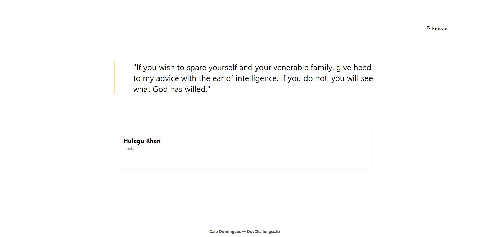

<!-- Please update value in the {}  -->

<h1 align="center">Quote Generator</h1>

   Solution for a challenge from  <a href="http://devchallenges.io" target="_blank">Devchallenges.io</a>.

  <h3>
    <a href="https://devchallenges-quotes.vercel.app/">
      Demo
    </a>
     | 
    <a href="https://github.com/caiodomingues/devchallenges/tree/master/quote-generator">
      Solution
    </a>
     | 
    <a href="https://devchallenges.io/challenges/8Y3J4ucAMQpSnYTwwWW8">
      Challenge
    </a>
  </h3>

<!-- TABLE OF CONTENTS -->

## Table of Contents

- [Overview](#overview)
  - [Built With](#built-with)
- [Features](#features)
- [Contact](#contact)
- [Acknowledgements](#acknowledgements)

<!-- OVERVIEW -->

## Overview

- Where can I see your demo?

Check it [here](https://devchallenges-quotes.vercel.app/).

- What was your experience?

Pretty nice, was funny trying to find the easiest (**not the best**) as a challenge to this one.

- What have you learned/improved?

I've remembered how to use the hook `useCallback()` in the correct way 😀.

### Built With

ReactJS.

## Features

This application/site was created as a submission to a [DevChallenges](https://devchallenges.io/challenges) challenge. The [challenge](https://devchallenges.io/challenges/wBunSb7FPrIepJZAg0sY) was to build an application to complete the given user stories.

## Contact

- GitHub [@caiodomingues](https://github.com/caiodomingues)
- E-mail [caiodss99@hotmail.com](mailto:caiodss99@hotmail.com)
